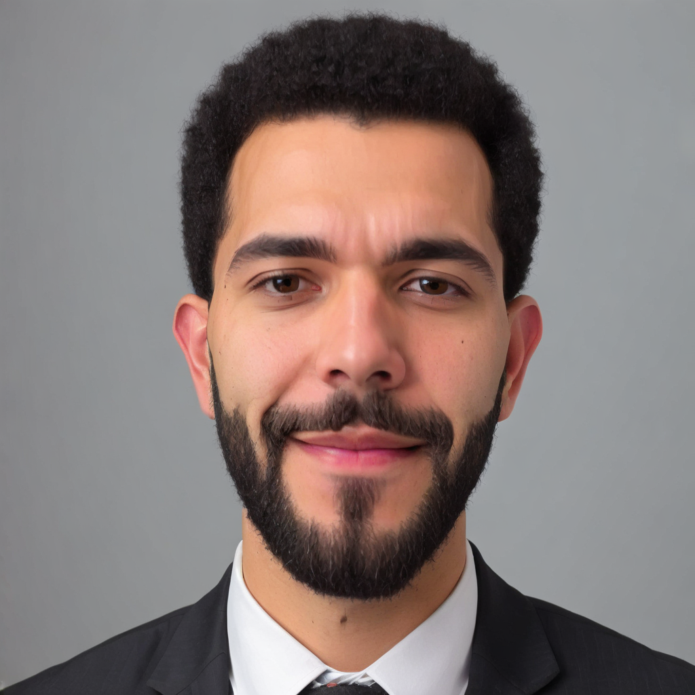
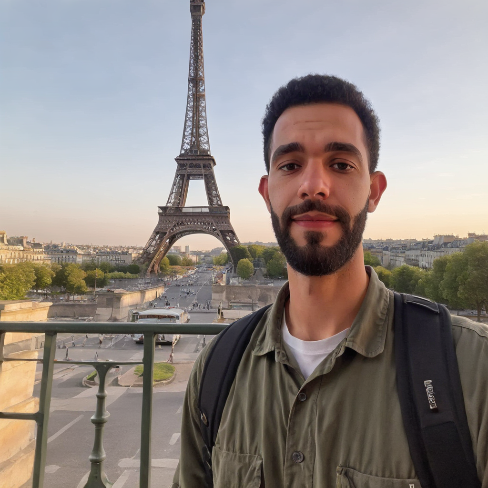
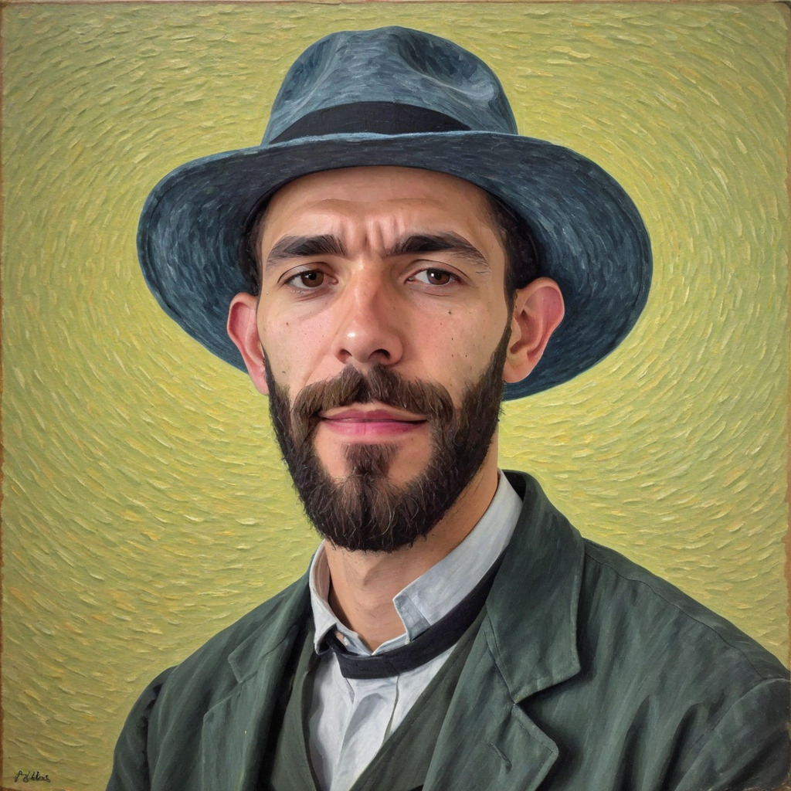

# Diffusion Models: From Fundamentals to Personalized Image Generation

Two-part project exploring diffusion models, from building a class-conditioned model from scratch to fine-tuning Stable Diffusion XL with DreamBooth + LoRA to generate personalized images of a real person.


<!-- Replace with a grid of the generated personalized portraits (test_driss_*.png) -->

## Overview

**Part 1 — Understanding diffusion models** (`notebooks/01_diffusion_from_scratch_and_sd_internals.ipynb`)
- Implemented a class-conditioned denoising diffusion model from scratch (PyTorch + 🤗 `diffusers`' `UNet2DModel`) trained on FashionMNIST, generating images from a chosen class label
- Analyzed failure modes: inconsistent sample quality within a batch, and uneven performance across classes
- Explored the internals of Stable Diffusion: the CLIP text encoder (tokenization → embeddings), and the VAE that compresses images into a latent space and reconstructs them

**Part 2 — Personalizing Stable Diffusion XL** (`notebooks/02_dreambooth_lora_personalization.ipynb`)
- Fine-tuned SDXL with **DreamBooth + LoRA** on a small set of personal photos to teach the model a specific person's identity
- Generated new, realistic images of that person in prompted scenarios/styles not present in the training photos

## Results

| Training photo | Generated: "in Paris, Eiffel Tower" | Generated: stylized portrait |
|---|---|---|
|  |  |  |

The fine-tuned model successfully generalizes the person's identity to new poses, backgrounds and styles it never saw during training, from as little as [N] training photos.

## Tech stack

- **PyTorch** — model implementation and training loop
- **🤗 diffusers** — `UNet2DModel`, `DDPMScheduler`, `StableDiffusionPipeline`, `DiffusionPipeline`, DreamBooth LoRA training script for SDXL
- **🤗 peft / LoRA** — parameter-efficient fine-tuning of SDXL (rank-16 LoRA adapters, incl. text encoder)
- **Stable Diffusion XL** (`stabilityai/stable-diffusion-xl-base-1.0`) as the base model

## Setup

This project was run on Google Colab (T4 GPU). To reproduce:

```bash
pip install -r requirements.txt
```

Part 1 downloads FashionMNIST automatically. Part 2 expects a small folder (10-20 photos) of the person you want to personalize the model on, and uses Hugging Face's official DreamBooth LoRA SDXL training script.

## Key learnings

- Class-conditioning a diffusion model just requires adding class embeddings that get added to the model's internal representations alongside the timestep embedding — a small architectural change with a big effect on controllability
- LoRA makes fine-tuning a multi-billion-parameter model like SDXL feasible on a single free-tier GPU by only training small low-rank adapter matrices instead of the full network
- Result quality with DreamBooth is very sensitive to the training photo set (variety of angles/lighting) and to the number of training steps — too few steps under-fits the identity, too many overfits to the training backgrounds

## Acknowledgements

Part 1 follows exercises and concepts from a generative AI / diffusion models course (Hugging Face Diffusion Models Course material and the *Hands-On Generative AI with Transformers and Diffusion Models* book, whose companion `genaibook` package is used for a couple of image-loading utilities). Part 2 (the DreamBooth/LoRA personalization) is original work applying these concepts to a real personalization use case.

Training photos used for personalization are used with the subject's permission.
